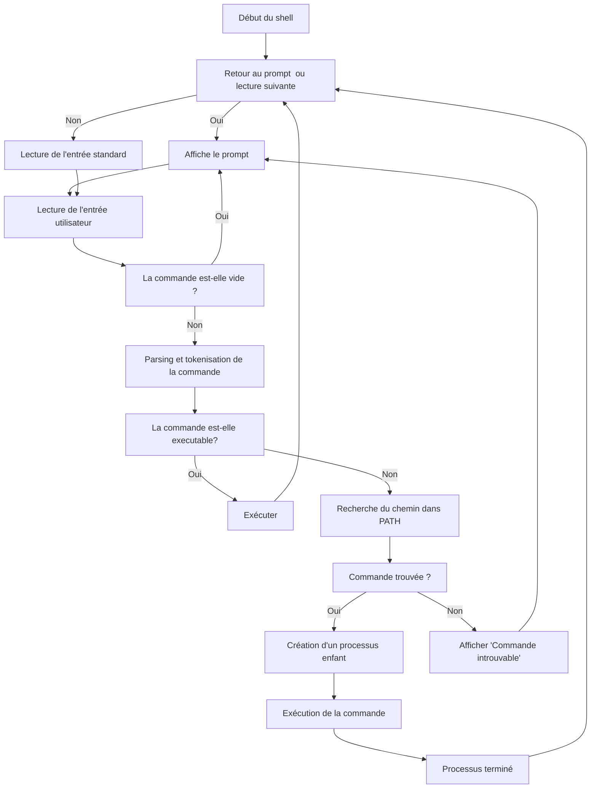

### **README.md**

```markdown
```
# Simple Shell

## Description
Le **Simple Shell** est un projet réalisé dans le cadre de la formation à Holberton School. Ce programme implémente un interpréteur de commandes Unix minimaliste en C. Il a pour objectif d'approfondir les concepts de programmation système et la gestion des processus en utilisant des fonctions Unix prsonalisé.

---

## Fonctionnalités
- **Mode interactif** :
  - Affiche une invite (`$`) et attend les commandes utilisateur.
- **Mode non interactif** :
  - Exécute des commandes depuis une redirection ou un fichier.
- **Gestion des commandes** :
  - `exit` : Quitte le shell.
  - `env` : Affiche les variables d'environnement.
- **Gestion des erreurs** :
  - Affiche un message clair si une commande est introuvable.
- **Support des chemins relatifs et absolus pour les commandes.**

---
## Diagramme du fonctionnement du shell

Voici un diagramme montrant le processus de fonctionnement du shell :


## Compilation
Pour compiler le programme, utilisez la commande suivante :
```bash
gcc -Wall -Werror -Wextra -pedantic -std=gnu89 *.c -o hsh
```

---

## Utilisation
### Mode interactif
Lancez le shell directement :
```bash
./hsh
```
Une invite (`$`) s'affichera. Entrez vos commandes, telles que `ls`, `pwd`, ou `env`.

### Mode non interactif
Passez des commandes via un fichier ou une redirection :
```bash
echo "/bin/ls" | ./hsh
cat commands.txt | ./hsh
```

---

## Exemples
### Mode interactif
```bash
$ ls
AUTHORS      cpid.c          man_1_simple_shell  simple_shell.c  tools.c
README.md    environement.c  modein.c            strchr.c
char.c       exiten.c        modenoin.c          strtok.c
condition.c  hsh             read.c              test_ls_2
cpath.c      images          shell.h             toknlize.c
$ pwd
/home/hmeyd/holbertonschool-simple_shell
$exit
```

### Mode non interactif
```bash
$ echo "/bin/ls" | ./hsh
AUTHORS      cpid.c          man_1_simple_shell  simple_shell.c  tools.c
README.md    environement.c  modein.c            strchr.c
char.c       exiten.c        modenoin.c          strtok.c
condition.c  hsh             read.c              test_ls_2
cpath.c      images          shell.h             toknlize.c
```

---

## Ressources utiles
Voici quelques ressources pour approfondir les concepts abordés dans ce projet :
- **[Manuels Unix](https://man7.org/linux/man-pages/)** : Documentation des appels système et commandes Unix.
- **[GeeksforGeeks - System Programming](https://www.geeksforgeeks.org/system-programming/)** : Articles pédagogiques sur la programmation système.
- **[Learn C Programming](https://www.learn-c.org/)** : Guide interactif pour apprendre le langage C.

---

## Auteurs
- **Ahmed Salem H’meyd**
  - Email : yyahmedsalm@gmail.com
- **Noumane Bouqetyb**

---
